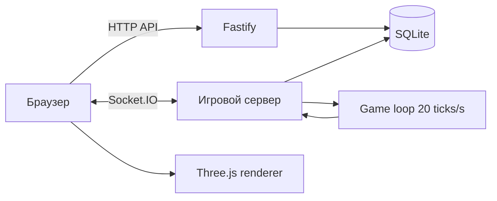

<div align="center">

# SPACE COMMAND: SKILLS+

### Многопользовательский космический экшен с прокачкой, способностями и серверной симуляцией

[](https://github.com/500EFKA500/ThreeJs/tree/Skills%2B)
[](https://threejs.org/)
[](https://fastify.dev/)
[](https://socket.io/)
[](https://www.docker.com/)

Создайте аккаунт, выберите корабль и войдите в общий космический сектор. Сражайтесь с другими пилотами, уничтожайте астероиды, получайте опыт и открывайте новые способности.

**[Запустить онлайн-версию](http://193.233.75.120:7000)**

</div>

---

## Что появилось в Skills+

Ветка `Skills+` добавляет полноценную систему развития пилота и расширяет боевую часть проекта.

| Уровень | Способность | Эффект | Перезарядка |
|---:|---|---|---:|
| `5` | **Энергетический щит** | Защищает корабль от снарядов и урона астероидов в течение 6 секунд | 25 сек. |
| `10` | **Шквал** | Выпускает сверхскоростную очередь из 40 плазменных снарядов | 40 сек. |
| `15` | **Сингулярный луч** | Создаёт огромный луч, уничтожающий всё на линии атаки | 120 сек. |

Во время активации сингулярного луча изображение становится чёрно-белым, а сам луч виден всем игрокам в секторе.

## Игровые возможности

- Авторизация и регистрация с хешированием паролей через `scrypt`.
- Аккаунты, настройки, улучшения, уровень и опыт сохраняются в SQLite.
- Свободный полёт в трёхмерном пространстве с управлением камерой мышью.
- Синхронизация игроков, выстрелов, урона, чата и способностей через Socket.IO.
- Серверная обработка движения, попаданий, столкновений и перезарядки навыков.
- Столкновения с кораблями и астероидами с отталкиванием и уроном.
- Полоски здоровья и позывные над кораблями других игроков.
- Радар, боевой прицел, hit-marker, журнал событий и чат эскадрильи.
- Настраиваемый цвет корабля и всего игрового интерфейса.
- Респавн игрока через 20 секунд после уничтожения.

### Астероиды и опыт

Астероид выдерживает **три попадания**. После уничтожения игрок получает **35 EXP**, а новый астероид появляется через **8 секунд**. Требование для следующего уровня рассчитывается по формуле:

```text
EXP для следующего уровня = текущий уровень × 100
```

Проверка попадания выполняется по всему отрезку движения снаряда между серверными тиками, поэтому быстрые пули не пролетают сквозь небольшие цели.

## Управление

| Клавиша | Действие |
|---|---|
| `W` / `S` | Движение вперёд / назад |
| `A` / `D` | Движение влево / вправо |
| `R` / `F` | Подъём / снижение |
| Мышь | Направление полёта и камеры |
| `ЛКМ` или `Space` | Основной огонь |
| `1` | Энергетический щит |
| `2` | Шквал |
| `3` | Сингулярный луч |
| `Enter` | Открыть или отправить сообщение в чат |
| `Shift` | Переключить режим полёта и свободный курсор |

В режиме полёта курсор скрыт и зафиксирован в окне. Нажмите `Shift`, чтобы взаимодействовать с интерфейсом или покинуть сессию.

## Технологии

| Область | Технологии |
|---|---|
| 3D-клиент | Three.js, WebGL, GLTFLoader |
| Интерфейс | HTML, CSS, JavaScript ES Modules |
| HTTP API | Fastify 5 |
| Real-time | Socket.IO 4 |
| База данных | SQLite через встроенный `node:sqlite` |
| Безопасность | `scrypt`, HttpOnly cookie sessions |
| Сборка | Vite 8 |
| Развёртывание | Docker, Docker Compose |

## Архитектура



Сервер является источником истины для здоровья, опыта, астероидов, попаданий и перезарядки способностей. Клиент отвечает за ввод, интерполяцию и визуальные эффекты.

```text
.
├── server.js                 # Fastify, SQLite, Socket.IO и игровой цикл
├── src/main.js               # Авторизация, меню, настройки и прогресс
├── src/game/SpaceGame.js     # Three.js-сцена, HUD и управление
├── models/scout.glb          # GLB-модель корабля
├── index.html                # Разметка интерфейса
├── style.css                 # Визуальный стиль и адаптивный HUD
├── Dockerfile
└── compose.yaml
```

## Локальный запуск

Требуется **Node.js 22+**.

```bash
git clone -b Skills+ https://github.com/500EFKA500/ThreeJs.git
cd ThreeJs
npm install
npm start
```

Откройте [http://localhost:7000](http://localhost:7000).

Для разработки с автоматическим перезапуском сервера:

```bash
npm run dev
```

Проверка production-сборки:

```bash
npm run build
```

## Запуск через Docker

```bash
docker compose up -d --build
docker compose ps
```

Проверить состояние сервера:

```bash
curl http://127.0.0.1:7000/api/health
```

Пример ответа:

```json
{
  "status": "ok",
  "uptime": 120,
  "playersOnline": 0
}
```

По умолчанию приложение доступно на порту `7000`. Внешний порт можно изменить в `.env`:

```dotenv
APP_PORT=8080
```

## Хранение данных

SQLite создаётся автоматически и не требует отдельного контейнера. В Docker база находится по адресу:

```text
/app/data/space-command.db
```

Compose подключает постоянный именованный volume `space-command-data`, поэтому пересборка контейнера не удаляет аккаунты и прогресс.

> [!WARNING]
> Не запускайте `docker compose down -v`, если хотите сохранить базу данных. Флаг `-v` удалит volume вместе с аккаунтами.

## Обновление сервера

```bash
git pull
docker compose up -d --build
docker compose ps
```

Контейнер имеет встроенный healthcheck и автоматически перезапускается после перезагрузки сервера.

## HTTP API

| Метод | Маршрут | Назначение |
|---|---|---|
| `GET` | `/api/health` | Состояние сервера |
| `POST` | `/api/auth/register` | Регистрация |
| `POST` | `/api/auth/login` | Авторизация |
| `POST` | `/api/auth/logout` | Выход |
| `GET` | `/api/me` | Данные текущего аккаунта |
| `PATCH` | `/api/settings` | Настройки интерфейса |
| `POST` | `/api/upgrade` | Улучшение модулей корабля |

## Лицензия

Проект распространяется по лицензии [MIT](LICENSE).

<div align="center">

**SPACE COMMAND // ENTER THE SECTOR**

</div>
